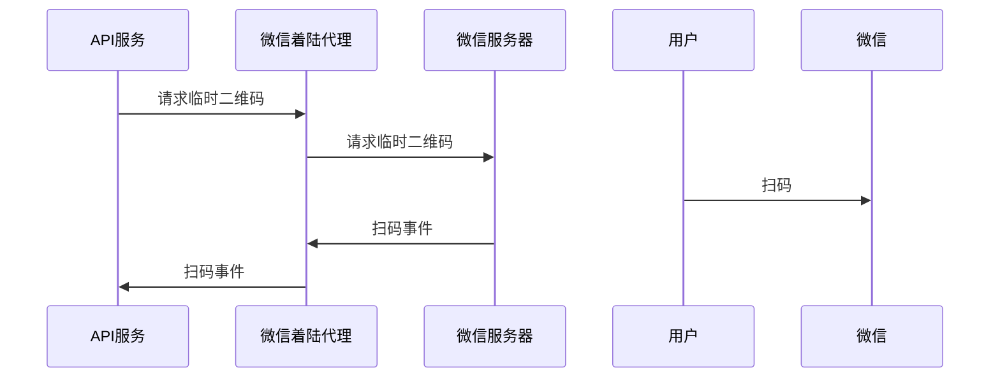

# 微信统一代理

主要解决多个应用共用一个微信公众号的问题，当前主要完成基于scene生成二维码，以及用户扫描二维码的回调问题。

## 使用方法

首先添加依赖

```xml
        <dependency>
            <groupId>com.mengyunzhi</groupId>
            <artifactId>wechat</artifactId>
            <version>1.1.0</version>
        </dependency>
```

### 请求临时二维码

```java
        // 团队微信代理服务器请求地址及请求前缀
        String wechatProxyRequestUri = "http://localhost:8081/request";
        // 用户扫码后的回调地址
        String callbackHost = "http://localhost:8080/wechat";
        String instanceName = "当前服务实例名称";
        // 对应的微信公众号appid，需要在团队微信代码服务器中进行配置
        String appid = "wx53bf06122618f768";
        // 用户扫码后，微信服务器回调的场景值，每个图片应该唯一
        String scene = "1234";
        WechatProxy wechatProxy = new WechatProxy(wechatProxyRequestUri, callbackHost, instanceName, appid);
        String imageUrl = wechatProxy.getTmpQrCode(scene, 6000);
        //        String imageUrl = wechatProxy.getTmpQrCode(scene, "callbackPath", 6000);
        System.out.println("微信扫码图片地址为：" + imageUrl);
```

此时用户扫码后，会将携带 `ScanQrCodeLanding` 的信息以POST的方式请求到 `callbackHost + callbackPath` 上，其中 `callbackPath` 为选填项，默认值为 `""`。

`ScanQrCodeLanding`中包括：`scene`, `appid`以及`openid`.

### 处理回调示例
```java
    @PostMapping("qrCodeScanLanding")
    void qrCodeScanLanding(@RequestBody ScanQrCodeLanding request) {
    }
```
此时用户端收到的信息为：`操作成功`

```java
    @PostMapping("qrCodeScanLanding")
    TextResponse qrCodeScanLanding(@RequestBody ScanQrCodeLanding request) {
        return new TextResponse("自定义文字提醒");
    }
```
此时用户端收到的信息为：`自定义文字提醒`

其它类型的返回尚不支持。

### 发送模板消息

```java
    // 生成数据项
    LocalDateTime now = LocalDateTime.now(ZoneId.of("GMT+8"));
    HashMap<String, String> map = new HashMap<>();
    map.put("first", title);
    map.put("keyword2", id);
    map.put("keyword3", now.format(DateTimeFormatter.ofPattern("uuuu-MM-dd HH:mm:ss").withZone(ZoneId.of("GMT+8"))));
    map.put("keyword1", level);
    map.put("keyword4", module);
    map.put("keyword5", description);
    map.put("remark", remark);
    
    // 构造模板消息
    MessageTemplateRequest request = new MessageTemplateRequest(openId, "templateId", map);
    wechatProxy.sendTemplateMessage(request);
```

其中：
* `openId` 为接收微信用户的openid
* `templateId` 为模板消息的模板id（在微信公众号管理端查看）
* `map` 是模板对应的数据

## 数据流

### 扫码




## 开发测试
先使用`mvn install`进行安装，然后在当前机器的其它项目便可以直接进行依赖了，测试没有问题后，便可以尝试发布 snapshot 包，而 snapshot 包在运行一些日子没有问题时，便可以考虑打正式包了。


## 发布流程

在pom.xml中添加：
```xml
<distributionManagement>
    <snapshotRepository>
        <id>oss</id>
        <url>https://oss.sonatype.org/content/repositories/snapshots</url>
    </snapshotRepository>
    <repository>
        <id>oss</id>
        <name>Maven Central Staging Repository</name>
        <url>https://oss.sonatype.org/service/local/staging/deploy/maven2/</url>
    </repository>
</distributionManagement>
```

注意：`https://oss.sonatype.org/service/local/staging/deploy/maven2/` 是正式库的地址，而 `https://oss.sonatype.org/content/repositories/snapshots` 是snapshot库。

由于 snapshot 发布后是随时可以变更的，所以适用于当版本不太稳定的时候。而正式库一旦发布便不可变更，所以适用于版本稳定的时候。

当包的版本以 `SNAPSHOT` 结尾时，将自动发布到 snapshots 库中。同时由于 snapshots 不是正式库，在其它引用该 snapshots 库的应用中，还需要把  snapshots 的仓库地址添加到 pom.xml 中。

### 配置maven用户名密码
打开 `~/.m2/settings.xml` 文件，并在 `servers` 中添加以下配置：

```
    <server>
        <id>oss</id>
        <username>ssues.sonatype.org's username</username>
        <password>ssues.sonatype.org's password</password>
    </server>
```

注意： 以处的 `oss` 应该与 `pom.xml` 中的 `snapshotRepository` -> `id` 相同。

### 启动签名
接着，我们在`pom.xml`中加入以入代码，以启用 GPG 签名：
```xml

<build>
            <plugins>
                <plugin>
                    <groupId>org.apache.maven.plugins</groupId>
                    <artifactId>maven-source-plugin</artifactId>
                    <version>3.0.1</version>
                    <executions>
                        <execution>
                            <id>attach-sources</id>
                            <goals>
                                <goal>jar-no-fork</goal>
                            </goals>
                        </execution>
                    </executions>
                </plugin>
                <plugin>
                    <groupId>org.apache.maven.plugins</groupId>
                    <artifactId>maven-javadoc-plugin</artifactId>
                    <version>2.9.1</version>
                    <executions>
                        <execution>
                            <id>attach-javadocs</id>
                            <goals>
                                <goal>jar</goal>
                            </goals>
                        </execution>
                    </executions>
                </plugin>
                <!--推送到maven官方仓库时，需要启用以下注释内容，以保证生成签名-->
                <plugin>
                    <groupId>org.apache.maven.plugins</groupId>
                    <artifactId>maven-gpg-plugin</artifactId>
                    <version>1.5</version>
                    <executions>
                        <execution>
                            <id>sign-artifacts</id>
                            <phase>verify</phase>
                            <goals>
                                <goal>sign</goal>
                            </goals>
                        </execution>
                    </executions>
                </plugin>
                <plugin>
                    <groupId>org.apache.maven.plugins</groupId>
                    <artifactId>maven-compiler-plugin</artifactId>
                    <version>3.8.0</version>
                    <configuration>
                        <source>1.8</source>
                        <target>1.8</target>
                    </configuration>
                </plugin>
            </plugins>
        </build>
```

如果有多个gpg，则还需要在属性中指定gpg的id:

```xml
    <properties>
        <gpg.keyname>F28358C2AAA021B831BAD7B559C086C400FC8E2F</gpg.keyname>
    </properties>
```

## 发布

```bash
$ mvn clean deploy
```

如果我们想使用一些变量来触发，则可以加入 -P 参数，比如：`mvn clean deploy -P release`，此时将会按 `release` 来自动设置一些变量（我们当前还没有用到）

此时在打包过程中会提供我们输入gpg密钥的密码，输入密钥后将进行签名及上传.

此时，如果我们当前包的名称以`SNAPSHOT`结尾，则可以直接在 SNAPSHOT 库中看到相应的内容（不需要审核），如果不以 SNAPSHOT 结尾，则需要进行审核。

由于 SNAPSHOT 本身是不稳定的，所以其它引用该库的项目，应该增加如下 `repository` 信息
```xml
<repositories>
    <repository>
        <id>snapshots-repo</id>
        <url>https://oss.sonatype.org/content/repositories/snapshots</url>
        <releases><enabled>false</enabled></releases>
        <snapshots><enabled>true</enabled></snapshots>
    </repository>
</repositories>
```

### 发送审核

如果是正式的库，则需要通过maven官方的一些审核，包括注释格式是否正确等。首先登录 https://oss.sonatype.org/ , 找到左侧的：Staging Repositories ，点击刷新 。然后我们刚刚推上来的jar包便会有一条记录。

选择该记录，然后选择标签卡上的 close。此时将进行待发布流程。稍等一会，再次点击该记录，下方的Activity显示successful后，便可以进行release了。点击该记录，点击release。此时将自动进行release环节。

此时如果没有问题，则会发布成功，可以在左侧的搜索中搜索相应的关键字来查看该jar是否发布成功。如果未发布成功，则可以在 Staging Repositories 仍然发现该条记录，点击记录也会出错错语的原因。

如果发布成功，稍等等待一会(这个时间不会太短，需要有一定的耐心)，则可以在 https://central.sonatype.com/ 官方中央仓库中找到该package。同时阿里云及其它仓库（比如：https://mvnrepository.com/ ） 的同步同需要一时间，需要有一定的耐心。

